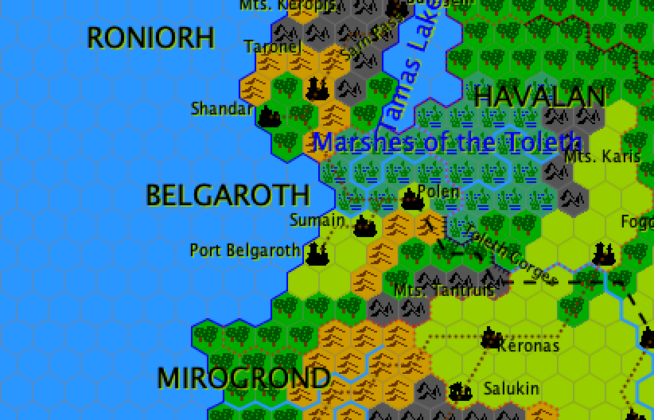

[[belgaroth]]
### Belgaroth

This country bordering the Great Western Ocean is one of the only democracies in the world of Firmellan, with <<veshan,Veshan>> in the <<chargos,Countries of Chargos>>. Another peculiarity is that Belgarathis are one of the most merchant peoples in the world. No significant commercial place exists in the world without a Merchant of the Republic. They are present in the most remote countries, negotiate huge quantities or sums, and they contribute to the influence of Belgaroth in the world. Thus this small country in the western Toleth Plains manages to control the influence of its giant neighbor: <<havenor,Havenor>>.

#### History

The fertile plains of the Toleth Delta were very early on occupied by the Ardains at the time of their felicity. The Fall caused a first exodus when the lands were devastated and two-thirds of the population were decimated by terrifying tidal waves. When the Gods ceased to be interested in mortals, the Ardains emigrated and the Angrist took refuge in the valleys of the Monts Keropis, north of their former territories. Only in the plains south of the delta remained a small community of Ardains, the Tereni. The latter lived mainly from deep-sea fishing and became great seamen.

When the first humans crossed the Tantruis Mountains, they colonized all the territory left at their disposal, leaving the Téréni alone (the latter formed only a very small community). The plains, like the marshes and the steps of the Tantruis Mountains, were soon occupied and exploited. Beautiful kingdoms flourished in these quiet lands. The Tereni taught humans the art of building large and beautiful ships capable of withstanding the rigors of the high seas. The land of the Noroths (for that was the name of this people from the west of the Tantruis Mountains) was a mosaic of kingdoms, fiefs and independent territories; but they lived in good neighborhood. Their navy was powerful: merchants sometimes went very far to trade, to the Straits of Sepp and beyond.

But while Noroth's kingdoms lived quietly, dark clouds were gathering in the north ... By the year one thousand before BM, the hordes of the Dark Gods and the Gods of the Giants crossed the Sarn Pass and reached the Noroth country. They devastated everything, pillaged and burned towns and villages. They would then cross the Tantruis Mountains to carry the destruction in the Toleth Plains. The seafaring peoples who lived on the coast sailed on all the boats available; they were deported to the north by unexpected storms and later landed on hostile shores - the Nogorod Havens. Those who could not flee were enslaved by the invaders.

The situation did not change for several centuries, except that the Noroths had learned to stay united in the face of adversity and to organize their survival as best they could, as well as to mount a semblance of resistance. When, shortly before the Battle of Mistarel, the Dark Gods gathered their dispersed troops, the land of Noroth was less guarded and Noroth took the opportunity to revolt and liberate the country. The capture of the ancient city of Saoth on the coast marked the end of the reconquest and the founding of the Belgaroth nation. The city changed its name to Port Belgaroth and the leaders of the rebellion gathered in the old palace, defiled by the occupation of the Goblins. It was in 36 before the Battle of Mistarel and the question of power was not resolved yet. As luck would have it, no leader had ever stood out from the crowd during the rebellion, and the warlords decided to leave the choice of their leader to the people and thus founded the Belgaroth Republic. Over time, the mere election of a chief for a limited period of time was refined: a Consul was elected, as well as the hundred members of the Council who debated laws. After several centuries of occupation and slavery, the country was united and had an exemplary government. As the country had lost none of its fertile lands, prosperity soon re-emerged in Belgaroth. Ships were built and went out to sail the oceans, as in the days of the Noroths. Decisive, enterprising and courageous, the merchants of Belgaroth, during the first century after the Battle of Mistarel, installed many trading posts in the ports of the world, still in turmoil, and increased year after year the wealth of the Republic. And as the kingdom of Havenor began to grow, the Republic was more powerful than ever. This allowed it to resist the expansion of Havenor, aided by the natural boundaries formed by the Tantruis Mountains and the Toleth Gorge. Belgaroth became the counterbalance to the power of the region and prevented Havalan to be integrated into the empire.

The leaders of Belgaroth were thinking of their expansion; they sent fleets to explore and colonize the dense forests of the Véglénion crater. The first explorers docked in Linedil Bay and drove the Eniens to reveal their presence. These Ardains had succeeded throughout the Dark Ages in hiding their existence from the whole world. If the Belgarathis could not colonize the territory of the Ardains, they obtained the right to build a counter in the Linedil Bay to trade with the Ardains. The Belgarathis merchants had long-standing privileged relations in their trade with the Eniens, in the city of Cedrin Olë. But the appearance of the Ardains in the Véglénion region had many other consequences, because it provoked the war between the Enien and the Angrist, and later the isolation of the Angrist of Karatras.

After this attempt to colonize a distant country, the Belgarathis were interested only in trade. And they became formidable, settling on all the known trading places of the world, and even in those which were not. A subtle game was established between these wise and courageous merchants and the Knights of the Temple of Havenor: they tried by all means to prevent the first to “loot” the riches of the empire. It is said that the merchants of the Belgaroth Republic were at the origin of the foundation of the city of Trame: this opened to them a gateway to the countries of the east, without passing through the taxed ports of the Havenorian empire. It is also known that the Belgaroth merchants are not all very recommendable and it is certain that the Norothlings pirates from the Nogorod Havens have sometimes concluded strange alliances with them…

At the height of the greatness and then the decadence of the Havenor empire, Belgaroth had to fight hard to safeguard his interests in the Toleth region. In order to preserve peace against a country whose armies were twenty times more numerous and supported by deities, the Belgarathis had to make concessions to the empire and allow it to build a paved road along the Toleth Gorge, linking Mirdanda to Polen. Thus the road to the great Toleth River joined the Sarn Pass, connecting the Origon Empire with Havenor. From Polen, one could go to Tir Kavéras by staying throughout the journey on the same paved road lined with inns and imperial relays!

When the Great War of Men broke out, the country of Belgaroth was not spared. As during the Black Age, the hordes of goblins and their servants descended from the north by the Sarn Pass. But the resistance was fierce and certainly more effective than that organized by the Knights of Havenor! The fighting was terrible, in the Marshes of Toleth then in the plains. Port Belgaroth was besieged for a long time and was reduced to ashes by an army of golden dragons from Hoornal. It was a massacre: not one inhabitant, not even one animal said, came out alive. Belgarathis from the rest of the country had sailed or crossed the Tantruis Mountains to join the Stone Pass (where they were killed or captured). Many Belgarathis joined Tir Kavéras, inflating the mass of refugees. Only a handful remained in the valleys of the Monts Tantruis to try to resist; their actions remained episodic and for the most part vain. Humans had almost all disappeared from the country! The Teneri Ardains had found refuge with the Eniens of Vegenion. Belgaroth had ceased to exist: only the consul Eguran maintained in the city of Tir Kavéras the memory of a once prosperous nation. At the end of his term, he was reappointed for life. When he died, there was no new election.

The Belgaroth country was liberated in 854 by the Havenor legions who occupied it to make it the base of naval expeditions to the north. It was from Port Belgaroth that hundreds of Jade Knights sailed, entered Origon, into the enemy's territory, and went to hide in the forests of the Green Lands. They played, four years later, a decisive role in the battles that provoked the defeat of the armies of the Black Gods.

The Belgaroth Republic was artificially reborn ­ it was the Emperor of Havenor who gave the country back its old autonomy… in exchange for very interesting commercial and diplomatic agreements. The Belgarathis had to give up the influence they had on the Sepp Strait fleets and make many concessions about their old trading posts in the empire's cities. In 881, during the discussions of Telabeth that led to the current definition of the Havenor empire, it was however possible to note that Belgaroth had not lost any influence because the Republic prevented Havenor from seizing the lands of Havalan.

The population of Belgaroth had fallen dramatically during the Great War of Men and the country was open to colonization. Many foreigners came to occupy the old villages of the plains and marshes, abandoned for several generations. Among these settlers were many Havenorians from the Toleth Plains.

This caused many years of division, quarrels or revolts. In 896 appeared the seeds of a civil war when the marsh provinces, most of inhabited by Havenorian, rebelled and marched on Port Belgaroth. The armies of the Consulate began to mobilize when an event occurred that brought together the whole country. Indeed, the Brigand Princes of Roniorh expected to take advantage of the disorder in their neighbors to invade. Faced with this threat, the Havenorians of the marshes, from rebels became beggars and asked the help of the armies of the Republic. Rejecting the brigands in their mountains was done in less than a season… Some later claimed that the invasion of the bandits had been skilfully aroused by some merchants of Port Belgaroth… A time restored, the union of Belgaroth peoples remained fragile. And the skill of the spies of Port Belgaroth was not enough in 1054 to prevent the civil war. In the opinion of many, it was organized and fomented by agents of the Havenor Empire, probably Templar Knights, who wanted to destabilize Belgaroth in its attempt to restore its former influence in the world of piracy, in the Lucerne country. This war, which finally caused little death and destruction, concentrated around the city of Sumain. The peasants of the south of the country as well as those of the marshes, scarcely knew that their country was at war. But the conflict disturbed the country enough for the trade to suffer. In 1059, a treaty was concluded between the two parties, which allowed the country to revive the merchant machine. The Marshes became a province of the Republic that could elect its own parliament. On the other hand, the supreme power and the command of the armies remained in the hands of a consul who was elected every six years by the whole country. It is this system that still works today. The assembly of the Marais sits in Polen. Southerners still suspect that those in the north are colluding with the Havenor empire, but this suspicion only leads to verbal contests at official meetings. Weapons have not served in the Republic for a long time, except on merchant ships and against Roniorh's Brigand-Princes. Agreements were concluded between the authorities of Belgaroth and the empire of Norvolan in exchange for the reduction of piracy activities and the creation of trading posts in the ports of the Republic; the empire of Norvolan undertook to protect Belgaroth from any massive attack of the Havenor empire.

##### Current affairs

Today in 1354, the Consul of Belgaroth must be reelected. This gives rise to great political unrest throughout the country, as well as large gatherings. Much further, in the Sea of Storms, Belgarathis seamen are gradually converting into the slavery trade, much less dangerous than piracy. They thus unleash their former Norothlings allies, who have much to do against the navies of the two empires, Havenor and Norvolan. Slaves are being used in the Republic, especially to colonize the depths of the Toleth swamps. But the traders mostly practice their trade, with countries like Nogorod or Kotei.

#### Geography

Belgaroth is an enclave between the Great Western Ocean and the Havenor Empire. It is separated from the latter by the Tantruis Mountains and the ravines of the Toleth Gorges. The only easy passage is a paved road built in the sixth century along the Toleth Gorges. To the north, the Toleth Delta also forms a natural border with Havalan and Roniorh. To the south, beautiful stretches of forest separate Belgaroth from the Angrist nation of Mirogrond. This last frontier is rather theoretical because only a handful of loggers and trappers occupy the area.

Belgarathis are separated into two communities, which gradually tend, generations after generation, to merge into one another. In the south of the country, the Noroths are in the majority; they are the descendants of the people who once colonized this region. To the north, in the Swamps of the Toleth, people are of Havenorian stock, coming from the Toleth Plains after the Great War of Men. Finally, on the coast, in the big cities, it is necessary to mention the existence of an important Elden community, the Téréni. These Ardains are great sailors and run most of the shipyards of Belgaroth.

[[marsh-of-toleth]]*Marsh of Toleth* - after the turbulent crossing of the Gorges, the Toleth spreads lazily in the plain, forming innumerable meanders and branches. The water ends up forming ponds and dead arms: the Marshes of the Toleth. It is a pleasant region, mosaic of ponds, groves, forests and rivers with dormant water. Wildlife is abundant, especially birds, and there are many people. They live on scattered farms, connected by canals. This is true for the western part of the marshes, the one claimed by Belgaroth. This region has been pacified for a long time, which is not the case in the eastern part of Havalan, where goblins and their servants are still quite numerous. It should also be noted that north of the marsh, the inhabitants built many traps and traps to defend against the brigands from Roniorh. A paved road from the Toleth Gorges stops at Polen. Its extension is less maintained, simple dirt road more often, and goes towards the north, towards Roniorh.

[[tantruis]]*Tantruis Mountains* - these mountains date from before the Fall. These peaks with tortuous valleys have always served to the Noroths of refuge during difficult times during the Black Age or the Great War of Men. There are indeed vast natural underground networks of caves. On the southeastern side, to the east, the mountains rise abruptly over the plain, forming impressive cliffs. In the south of the country, a small community of Angrist lives in the caves. These Do'tis are the distant descendants of the Angrist who once lived in the plains of Belgaroth before the Fall. They live very discreetly, and have only rare contacts with Mirogrond.

[[polen]]*Polen* - this city is built on a small hill overlooking the Toleth marshes. It is a pleasant city, whose houses are built of white stone imported from the southern plains. During the floods of Toleth, Polen is an island: the inhabitants then move by boat. The city is also the capital of the Marsh province, with a majority of Havenorians. Every five years they elect a council of fifty members. The latter decide laws in the Marsh and have the charge of justice. However, they must obey the Consul of Port Belgaroth with regard to the army and the problems of national importance.

[[port-belgaroth]]*Port Belgaroth* - this city, built in length along a sandy bay, was completely destroyed during the Great War of Men. It was not just rased; the Goblins scattered the stones and massacred the inhabitants to the last. Later, Port Belgaroth was rebuilt and a large monument was erected in the center for the martyrdom of the city. In fact, the city is built mainly around this large column and around the large port dug along the bay. This port is the largest on the west coast of the continent. It is also the seat of the power of Belgaroth, in the large palace built against the Column of Martyr. Most Tereni live in Port Belgaroth.

[[sumain]]*Sumain* - it is an old city built along the banks of the estuary of the main branch of Toleth. To the north are the marshes. The only bridge on this branch of the river is at Sumain, built about twenty meters high to cope with the high tides and tides. Sumain is therefore a strategic point for the passage between north and south. In the eleventh century, the rebels of the Marsh managed to take the city and hold it for five years against the Republican armies of the south. She inherited from this past high and thick fortifications.

##### Climate

Belgaroth is isolated from the rest of the continent by the Tantruis Mountains and further north by the Karis Mountains. As a result, the region is experiencing the rigors of the ocean climate. But if this climate can sometimes be difficult because of the frequent rains, it brings a remarkable fertility to the cultivated lands.

##### Economy & wealth

The Belgaroth Republic is a rich nation, thanks to its many natural resources but also thanks to the income that the merchants of the different trading places of the world bring back. In fact, this small nation could perfectly support its own needs but thanks to the energy of its inhabitants, it has established itself as a power to count with in this region of the world.

##### Currencies

The Belgaroth nation is rich and powerful enough to strike its own currency. Nevertheless, its precious metal resources are not sufficient to allow the striking of a pure gold coin. The Tek (copper) is equivalent to one quarter imperial crown of Havenor. The Nek (copper with a silver hoop) is equivalent to two crowns of Havenor. Then there is the Têpren (in silver, twenty crowns), the Mitr (in silver, a hundred crowns) and the Bel (alloy of gold and silver, eight hundred crowns).

##### Magical affinity

The Belgaroth region knows only a normal magical affinity. There is a small guild in Port Belgaroth and in general the magicians are well received in the Republic. They are most often employed in rural communities where they play the role of advisers and helpers during major works.

#### Society

The Belgaroth Republic is a united nation: the north / south divide between the Havenorians and the Noroths is now part of history, although many traditions still celebrate this fact, in the form of friendly clashes or fairs. A political separation, however, still exists.

The people of Belgaroth are very rural, their towns and villages are not very extensive while the relative tranquility of the countryside has led to a large dispersion of their farms in the fields. In fact, even if he remains hospitable, the Belgarothi peasant loves his peace. Quite the opposite of this conservative rural mentality, the Port Belgaroth sea merchants never stop traveling around the world to discover new markets or new products. Their fleet is powerful, often well armed and increasingly protected by ships of the Imperial Navy of Norvolan, since recent agreements. These same agreements led to the disappearance of the tolerance that existed between certain Belgarathis merchants and pirates. But these unscrupulous merchants have now turned to slavery, which some notables of the Republic are beginning to practice.

##### Government

Every five years, a Consul is elected by the population. At the same time, two assemblies are elected in the same way: one in the south and one in the Marshes, which sits at Polen. Government envoys travel through villages and farms across the country to collect votes. This usually lasts three to four months and gives rise to numerous speeches and political campaigns, as well as many bribes, especially in the Marsh, where the democratic tradition is less strong.

Currently, in 1354, elections are held. The outgoing Consul, Béguin Kode, is a favorite but his main opponent, Emin Droer, mayor of Polen, attracts many supporters, even in the south. He is said to be ambitious and calculating whereas Kode is rather conservative. Detractors of Droer accuse him of being a pawn in the hands of the Emperor of Havenor. If Emin Droer were elected, he would be the first consul from the Marsh.

##### Religion

As much as the people of the south, the Noroths, practice almost no worship, except perhaps the very discreet one of Cochime, the people of the north, of Larne origin, are very pious. They adore essentially the Triad but also the Twelve Knight Gods. The Noroths accuse the people of Polen of being bigots while the people of Polen accuse the Noroths of being atheists… The clergy is non-existent in the south but has a real influence in the north.

##### Armed forces

Belgaroth's army is under the orders of the Consul. Its elements are recruited throughout the country, in order to minimize friction between north and south. It is an effective army, as it has shown repeatedly against pirates on distant seas or against Roniorh's brigands. While the Noroth peasants know almost nothing about the use of arms, those in the Marshes know how to fight, because brigands or even goblins sometimes make incursions into their homes.

##### Social status

Bandit (-3), Slave (-2), Farmer (0), Merchant, Sailor, Soldier (1), Merchant, Priest (2), Burgomaster (3), Member of one of the Councils (4), Consul of Belgaroth (6).

##### Languages

The official language of Belgaroth is Belgar, a slight variant of the Western Language (it has a significant proportion of Larne). But the people of the Marshes speak between them the Larne of their ancestors.
