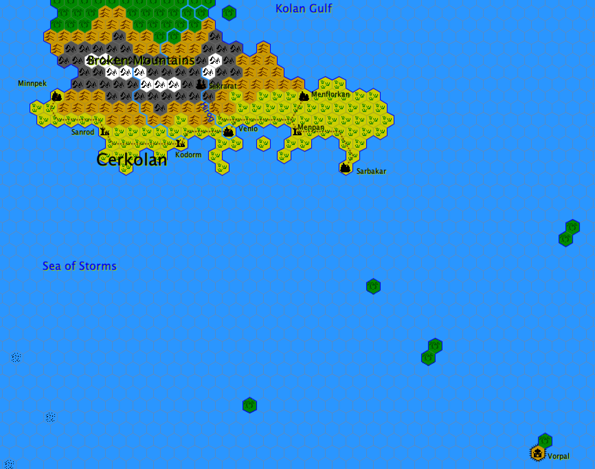

[[cerkolan]]
### Cerkolan

It is a barbaric, theocratic and cruel nation. Yet heir to a rich and prosperous past, this region fell under the boot of a religious tyranny which it was never to leave.

#### History

During the Black Age of the world, some human peoples chose to serve the evil hordes of the Dark Gods. These savage and warlike peoples acted in the desert regions of <<ne-hebel,Ne-Hebel>> and <<mung,Mung>>, where they sowed destruction and terror. But when their deities, who had been abandoned, fled, these savage tribes had to flee to the east and plunged into the depths of the Great Sea of Trees. Some tribes flourished there and became the tribes of Sarn'Atan, but many lost themselves there and disappeared. And still others continued their progress and arrived in what would become <<sandokor,Sandokor>> and <<kotei,Kotei>>.

But one tribe instead turned their steps south-east and reached the shores of the Kotei Sea, between two mountain ranges at the Gulf of Kolan. There, they lived for decades of fishing in the mangroves of the seaside. But other tribes harassed them, come from the interior of the jungle, and these fishermen had to go to sea on fragile boats. They reached the lands of Cerkolan towards the end of the 2nd century after BM. They were the Kolanires.

On the Harlong Peninsula, south of the Broken Range, the land was not deserted. They were inhabited by shepherds who had built city-states along the coast. These men and women were the descendants of a people who had fled the disasters of the Black Age, around the fourth century before BM, from the coastal plains of Irenimelan. There, along the coast and in the savannahs of the peninsula, they had rebuilt their civilization. Many gods gave them their support. This people was the Brophas. Until the arrival of the Kolanires, they had built large and solid cities of red stone, and their temples were as colossal as they were rich. The whole coast was covered by a paved road. The Brophas formed a great and beautiful civilization that had survived the rigors of the Black Age thanks to its isolation.

The Kolanires landed east of the peninsula around the middle of the 2nd century after BM. The Kolanires and the Brophas coexisted for a time without colliding, but conflicts became more and more frequent as the ancient fishermen became shepherds. The result of the conflict left the Brophas masters of the field; the Kolanires had to take refuge on the heights of the Broken Chain to survive.

In a dark valley of the Broken Chain, around the year 220 after BM, the Kolanires built a city of black stone and a huge temple of red stone. In this cursed city of Sakrarat, they resumed their old practices dating back to the Black Age and turned again to the Dark Gods. But these were far away and did not hear the calls of their faithful. For years, the calls of the Kolanires, punctuated by multiple human sacrifices, were going to be in vain…

Towards the end of the 2nd century ABM, merchants and emissaries from the Norvolan Empire had more and more frequent contacts with the city-states of the Brophas. And in 213 after BM, agreements were signed with the princes of the cities, allowing the Norvolan to open commercial trading posts in the towns of Sanrod, Venio and Menflorkan.

Meanwhile, in the mountains, Kolanires still practiced their infamous witchcraft but their calls were still unanswered. Until the summer of the year 356 after the Battle of Mistarel. A Forgotten God, who was living like a wanderer in the Great Sea of Trees, heard the wild calls of the Kolanires. This God had been driven mad by his centuries of wandering in the forest and when he revealed himself to the priests of Sakrarat, his appearance was awful. The Kolanires prostrated themselves and calling him Kolan, named after their former tutelary deity during the Black Age. This mad God lent himself to the game and ended up behaving like a Black God. He had indeed become Kolan. He reduced his worshipers to slavery and offered them the power of his magic. In 372, more numerous than ever, completely fanatised and galvanised by the magic of their god, the Kolanires descended from the mountains and attacked the Brophas completely helpless in the face of this totally unexpected invasion. The city-states were stormed, some burned or razed, in less than a year. The embassies of Norvolan were abandoned. Thousands of Brophas were enslaved and hundreds sacrificed to the mad god Kolan. The latter took advantage of it to increase his power, like any self-respecting Black God. From then on, Cerkolan was cut off from the world; the Kolanires were masters at home and would live in Kolan's service for centuries under terrible slavery.

##### Current affairs

Nothing has changed since the Kolanires' uprising in 372. Kolan reigns over his people as the cruel tyrant he is. The Kolanires, less and less numerous with time, are the consenting slaves to a terrible divinity. But they themselves form the ruling and impitoyable diriging caste of a nation of slaves constituted by the descendants of Brophas.

The Kolanires believe that being in the service of Kolan, an incarnated God (not like those of other peoples), makes them an elected people. The other races are only meant to serve as slaves and sacrificial victims. The many slaves who descend from the Brophas are obviously not of the same opinion. Far more numerous than the Kolanires, they do not have the strength and the will to revolt. Moreover, the priests of Kolan are able to read minds and reduce to nothing any desire for rebellion.

#### Geography

Cerkolan was a country that had everything for it: vast, fertile meadows, rich waters and many mines in the mountains. But the tyranny of Kolan completely overshadowed the economic future of the region. Everywhere we see only vast mud fields where hordes of Brophas slaves work. The ruins of ancient agricultural villages can be seen. The old city-states are only a shadow of what they once were. The old road paved with the coast is nothing but a memory disappeared under the mud and the undergrowth.

[[broken-chain]]*The Broken Chain* - these mountains (some of which rise more than three thousand meters) separate the Cerkolan peninsula from the jungles of the Great Sea of Trees. The Broken Chain is not from the Fall. It owes its name to its general form: a long, narrow mountain that was broken to form the Chain. Some of these “breaks” form passages to the Great Sea of Trees. Kolanite expeditions sometimes use them to capture natives living on the other side of the mountains. At the same time, they become more and more rare because the God Kolan particularly appreciates the sacrifices of strangers.

[[gulf-of-kolan]]*The Gulf of Kolan* - it is a vast bay sheltered from powerful currents coming from the west. Thus, the waters are colder and less fishy than elsewhere. The gulf is avoided by both the Kotei galleys and the Imperial Navy of Norvolan. However, Kolanires do not have a fleet of war (nor any fishing fleet).

[[menflorkan]]*Menflorkan* - an old city-state, converted into the breeding of slaves Brophas. It is in this city that are sent all the children Kolanires, where they learn to maltreat their counterparts of Brophas… A horrible city, worthy of the madness of Kolanires.

[[minnpek]]*Minnpek* - it's a farming town. Slaves are a little less unhappy than elsewhere. The living conditions are still very hard and it happens relatively often that Brophas die while working in the fields.

[[sakrarat]]*Sakrarat* - the center of all Cerkolan, the home of God Kolan and his closest followers. It is an infernal, abject city, one would think back from the most atrocious years of the Black Age. Built of red and black stone, dazed architecture, its center is the terrifying temple of Kolan. It is a pyramid of red stone, adorned with fine and pointed towers as useless as menacing. Stakes of wood, stone or metal forbid its access to anyone. A staircase dripping with blood rises to its summit. There, on an esplanade decorated with skulls, the highest priests of Kolan sacrifice each day to their divinity dozens of slaves Brophas or traitors among the Kolanires. The victims are bled and then dragged still screaming to the central well of the pyramid where can feed Kolan. Sometimes this horror comes out of its putrid pit and ventures into the country of Cerkolan to seek his own victims! But this does not happen too often because Kolan remains a Forgotten God even if he claims to be a Black God: most of his power was absorbed by the Seven Stones Quest and the sacrifices serve essentially to provide him with powers worthy of a deity.

[[sanrod]][[kodorm]][[menpan]]*Sanrod*, *Kodorm* and *Menpan* - these ruins are those of old city-states destroyed during the insurrection of 372. The gods once worshiped by the Brophas, deprived of worship, were slowly but surely sentenced to death. From now on, their temples are cursed and avoided by the Kolanires. It is even said that the ruins of Menpan, an ancient religious city, would be haunted by Brophas ghosts… In other city-states, the temples were razed.

[[sarbakar]]*Sarbakar* - this city, very isolated from the rest of the country by an isthmus, is certainly the most livable among the cities of Cerkolan. In fact, Sarbakar was not too damaged during the insurrection of 372. Since then, it is a craft center: it is in this city that under the tyranny of Kolanires, hordes of slaves Brophas work wood, straw, stone, or metal to provide their terrible masters with all the things they might need. The old port of the city was completely destroyed by the Kolanires and their militias carefully watch the coast. Because many are the Brophas who are trying here to flee Cerkolan. They embark on rafts of fortune hoping to join a convoy of Norvolan or Koteï. Unfortunately, they often come across pirate ships that capture them and then sell them back to Trame.

[[venio]]*Venio* - the antechamber of hell. The Kolan Reelers (see below), when they return from their expeditions, all pass through this city. Built of wood in the meandering meanders of the Hirog delta, it escaped the fire that was to destroy it in 372 only thanks to the rain which poured down on the day of the assault. It keeps from this past a strange appearance: expanse of blackened wooden houses on stilts over brown and thick waters. A vague smell of wet ashes still lingers in the streets cluttered with garbage. The old port is cluttered with the numerous shipwrecks of the Brophas and Norvolan that were sunk on that fateful day of the year 372 after BM.

In the center of the city, on an island of land, there is a vast square covered with a wooden roof. This is where the Reelers pack in dreary conditions hundreds or thousands of Brophas, before sending them to the horrors of Sakrarat. In the mud, humidity and cold, these poor slaves die by dozens during the months they remain in Venio.

[[vorpal]]*Vorpal* – let’s leave the atrocities of Cerkolan to head for the rich and warm South Seas, dotted here and there with islands covered with jungle. The Sea of Snakes has many islands. Most are deserted, some are used as havens for pirates. But there is one more particular, a mythical island, an island named Vorpal. At once dreaded and sought after, this island whose maps do not mention the exact location gave birth to many legends. Some appear sometimes fanciful, others contradict each other, but we sometimes manage to distinguish a background of truth.

Thus, from all these stories, it seems that one can say that Vorpal is an island of quite large size, all in length. One of its extremities would rise abruptly above the waves (the upper part) while the other would be a land of flooded jungles and mangroves (the lower part). From there, the lands gradually rise, the jungle, populated by dangerous creatures, disappears little by little to leave place with scrubby and haunted hills. And at the highest point of the island, clinging to the cliff, stands the Palace of Vorpal. Who is Vorpal? Or what is it? There the stories diverge considerably. For good reason: the explorers having once managed to get into this strange palace never returned. Certainly, some managed to approach, but most were frightened by what they saw around, without remembering what. Some of their companions managed to penetrate the heart of the palace, and no one knew ever what happened to them. Who is this Vorpal? Or what is it? A Forgotten God? A Black God? An Ancient Creature of the Night? A dragon? Something else altogether? What is certain is that this thing, whoever or whatever it is, is evil. And yet, endlessly, men or women face the dangers of the ocean, lowland swamps, jungles and hills to try to penetrate the heart of the palace. There, the most cowardly (or the luckiest) turn bridle and try to leave the island, having forgotten everything about the palace and its surroundings, if not that intense feeling of fear that perhaps saved their lives. The others, they pass under the enormous arches that surround the palace and disappear forever from the surface of the world. Why are they trying this adventure? For riches? For the glory? The worst thing is that we almost never know it. Some adventurers invent one day a reason to go in search of the Vorpal and either they disappear forever, or they come back, the eyes tarnished by a vague madness and an unnamed fear.

##### Climate

Cerkolan knows only two seasons, which share the year equitably. First there is the Rainy Season, a time when countless clouds swarms from the south pour down their torrential and icy rains on the land. Then warm winds from the west drive the clouds and bring the Dry Season. Then, the rivers dry up, the fields toil and the flora enters a phase which allows it to wait for the next rains. Formerly, these two seasons made the richness of the agriculture of the Brophas. Now, the fields, less well maintained, are leached by rain and crops destroyed by drought.

##### Economy and wealth

The theocracy of Cerkolan has no economy: the slave labor is only intended to feed and supply the Kolanires. In this sense, Kolanires are perfectly autonomous and live in autarky. If one examines the system a little more closely, one realizes that all the efforts in the country, whether those of priests, Kolanires or Brophas slaves, only serve to serve the deity Kolan. A whole territory and a whole people at the service of the madness of a god.

##### Magical affinity

It is quite high in all Cerkolan and is even higher in Sakrarat. There, chaos, on the occasion of great ceremonies in honor of Kolan, sometimes form formidable pockets that remain active for years before giving birth to creeping and sprawling atrocities. These monsters born of chaos under the influence of the malignant will of the place are worshiped as Berm Atkaal (“angels of death”).
Sorcerers do not exist in Cerkolan, only priests practice magic. It is mind-oriented: the priests of Kolan are masters at reading thoughts or controlling minds. They sometimes have particularly destructive powers: winds of fire, crevices creation and invocations of demons and Berm Atkaal.
As far as we know, the island of Vorpal has an extremely high chaotic affinity. This one is concentrated at the level of the palace which overhangs the western cliffs of the island. Yet no magic phenomenon has ever been noticed nearby. But we do not know what's going on inside.

#### Society

Cerkolan is a theocracy, in the proper sense of the word: governed by a deity. The ultimate leader of the whole country is indeed Kolan himself.

##### Government

Certainly no one is able to control or stand up to Kolan, and the god is the ultimate master of all things. But priests, when they are far from the den of the god or the city of Sakrarat, are invested with an authority no less important because they enjoy powers of divine magic. The hierarchy of Kolan has three circles. First there are the High Priests, three in number. One, the Grarat, is personally responsible for the sacrifices to the god, another, the Onghor, administers the kolanire forces in Sakrarat and the last one, the Yrgun, deals with the other territories of Cerkolan. Then there are the Priests. They are only found in Sakrarat. They prepare the sacrifices for the Grarat, take care of the future victims and the administration of the city under the command of Onghor. They also serve as a strike force to subdue the few rebellions of slaves. Under the orders of the Yrgun, we find the members of the third circle: the Acolytes. There are three types: the Reelers who “collect” the future sacrificed among the slaves Brophas throughout the country, the Supervisors, they administer under the direction of a priest the activities of cultures or handicrafts. And there are the devotees, with many magical powers, who roam the country in search of hotbeds of rebellion.
Subject to the religious hierarchy, there are three secular castes: the masters who oversee the slaves, thewarriors escorting the devotees and the Reelers. The Kolanires who do not belong to these two classes live in Sakrarat, in the personal service of the clergy.

##### Religion

It will be understood: there is only one cult in Cerkolan. And this religion shapes the whole country. Everything is settled in this poor nation according to the requirements of the god Kolan. The priests are themselves in the absolute service of the deity (we do not resist a living god, nor do we try to manipulate him) and sometimes they serve as victims of the sacrifice… But on the other hand, they remain the masters of the hordes of Brophas slaves.

##### Armed forces

The Cerkolan army has only one function: to subdue the Brophas rebellions. Admittedly, the treatment inflicted by the Supervisors deprives slaves of all dignity, but sometimes a Brophas becomes aware of his condition and tries to lift his companions. These attempts are always doomed to failure: the Devotees get to read the spirits and designate the “faulty” settlements to  the Kolan warriors who “cleanse” the rebellion in a dreadful bloodbath. The survivors are then sent to Sakrarat. This city is defended by the Priests of the Second Circle, trained in command, magic and arms.

##### Social status

Brophas Slave (-5), Abroad (-4), Kolanire Servant (-2), Foreman, Warrior (-1), Watcher, Rewinder (0), Devotee (1), Priest (2), Onghor, Yrgun (4) ), Grarat (5), Kolan (10).

##### Languages

The Kolanires speak Kolan, a dialect that has nothing to do with any known language. The Brophas speak Brophas, a wave derived from the ancestor of Larne (-8).
