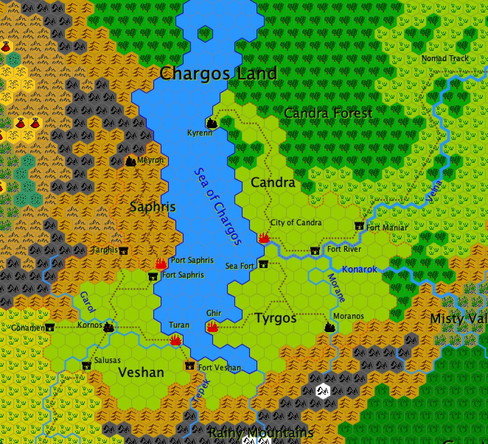

[[chargos]]
### Countries of Chargos

The denomination of Countries of Chargos refers to all the regions surrounding the Chargos Inland Sea. These countries stretch from north to south along an axis formed by the Chargos Sea. If the southern part of the Chargos countries, divided into four nations, is heavily populated and civilized, the northern part is wild and unoccupied.

#### History

If the shores of the Chargos Sea were soon occupied by humans, this colonization did not last until the Black Age. When the Dark Gods and Giant Gods unleashed their evil hordes over the world, the people were utterly decimated in this part of the world. An Angrist people had founded a beautiful civilization in the Chargos Mountains. It tried to resist for a time the armies from what would later be called the Desolation, but was completely annihilated. The only surviving signs of their existence are the impressive ruins of Fort Chargos and some underground cities in the mountains, abandoned for centuries.

It was not until the end of the Black Age that people returned to settle on the shores of the Chargos Sea. But their colonies remained confined to the south of the Chargos country, for in the north the influence of Desolation and <<hoornal,Hoornal>> was too much felt. All these people who settled on the shores of the Sea of Chargos came from the northern regions of the <<ne-hebel,Ne-Hebel>> desert or the savannahs of <<mung,Mung>>. Part of this population continued east and became the nomadic people of <<kovsa,Kovsa>>.

The people of Chargos, at that time, were hardly civilized: the cities did not exist, and the tribes often lived by the plunder of others. Only the south-west region developed more peacefully: cities appeared there rather quickly, as well as a centralized and strong power. Thus was born the Kingdom of <<veshan,Veshan>>, first of the Four Kingdoms of Chargos, between the 1st and the 2nd century after the Battle of Mistarel.

By the middle of the 3rd century, this kingdom of Veshan was by far the most civilized and prosperous in the region. Elsewhere, it was a collection of small, barbarous and bellicose nations. Armed with the power of her army, Queen Idriss the Conqueror spent fifteen years seizing all the territories of the shores of the Sea of Chargos. In 386, Queen Idriss was crowned Empress of Chargos. It was under her reign and under those who succeeded her that the Countries of Chargos developed. Uncultivated lands were cleared for exploitation, tracks and roads were opened, and a fine merchant marine ensured a fruitful trade between the different ports of the Chargos Sea. Slowly, the empire of Chargos grew, until reaching its peak in 618.

That year, the Emperor Gidre died without descending. This had already happened in the past that an emperor has no heir: it was then a nephew or niece who took the reins of the empire. But this time, the situation had changed. Gidre had been a weak emperor, who had allowed some feuds to fester in the east, between several counties. Moreover, in 618 the imperial family was particularly extensive. All of these elements added to each other transformed succession problem into a civil war.

The war lasted thirty years, at the end of which the empire was divided into four independent kingdoms: Saphris, Veshan, Tyrgos and Candra. Their respective boundaries have not changed much since then. The empire was certainly divided, but the wars had ceased, and commerce gradually resumed around the Sea of Chargos.

In 763, when the war seemed to be forgotten, the attack of hordes from Hoornal took the kingdoms of Saphris and Veshan by surprise. These two regions were completely looted and ravaged by the Hobgoblin armies, who then began their advance towards lrenimelan. However, other goblin troops descended the Mountains of Shadows and occupied the four kingdoms, in order to make a rear base for the southern armies. The people of Chargos were reduced to slavery.

This situation caused a mass exodus of the population towards the steppes; the nomads of Kovsa then had to go north to Sarg and Kigal. It is the forced exodus of these last populations which is at the origin of the secular enmity which reigns between the people of Sarg and those of Kovsa.

Everything changed in 855 while elsewhere in the West, the wind of war was gradually turning. A man, a prophet named Nephros, appeared in the east of Tyrgos, declaring himself as the Living God of Chargos. Most people took him for a fool, but they changed their minds when they saw what he was capable of. Nephros was in fact a Forgotten God, who had taken upon himself to liberate the Chargos Land from the yoke of the Dark Gods. Like a hero of legend, he used his extraordinary powers against Goblins and their servants, and rallied to him all the population of Chargos. The uprising was general! Once the whole country was liberated, Nephros launched his armies towards the steppes of Mung, where he led them to victory against the armies of Hoornal. It was thanks to this action that in the West the armies of Havenor were able to win the Battles of Toleth because they were previously threatened in the east by the same armies that Nephros defeated.

When the Great War of Men ended and the infernal armies retreated into the Desolation, into Hoortnog or Hoornal, the prophet Nephros disappeared as suddenly as he had appeared!

This soon caused a great disturbance in the population of Chargos. But the clergy who had been created during the revelation of the god Nephros took things in hand by claiming to act in the name of their deity. They were able to restore calm. In truth, these so-called priests of Nephros held their magical powers from another source: the magic of Chaos! But the subterfuge worked and in 867, Nephros' Theocracy dominated all the ancient kingdoms of Chargos.

If calm had returned to this part of the world, prosperity was still missing. For the priests of Nephros were imbued with their power and ruled as tyrants over the population subject to their power.

But such domination based on artifice could not last forever. the deception of the “divine powers” was revealed in 915 by a priest named Astalus. The latter took thus revenge for not having been named high priest of the city of Ghir. When the news spread, the priests were not long to be lynched throughout the country by angry crowds. The Countries of Chargos returned to chaos. A former Veshan prince, Netel Azur, wanted to restore the former Idriss empire, but he met the hostility of his peers and finally triggered a terrible war. Early in the 9th century, the four kingdoms of Chargos had regained their borders, but peace did not return either. And the war still continues today between the Four Kingdoms of Chargos.

##### Current affairs

If officially the war continues, it must be said that things are quieter. One cannot wage a total war for several centuries… Tyrgos and Candra look like earthen dogs on both sides of the Velna, Saphris and Veshan are stranded on their border, Tyrgos and Veshan fight a war of skirmishes on their land borders as on sea.

###### Saphris

This tiny kingdom survived the power of Veshan only thanks to the tenacity and bravery of his warriors. But the kingdom of Saphris does not extend further than the hills. There, they have the control of the ground, whereas in the plains, it is the horsemen of Veshan who make the difference. Port Saphris has heroically resisted for two centuries by the repeated assaults of Veshan's armies.

###### Veshan

Veshan is rich and prosperous; it benefits in effect from the benefits that the Orient Gate gives it, this road which crosses the savannahs of Mung until Irenimelan. Its army is powerful, but it has never been able to overcome those of other countries. It can not fight on many fronts at once.

###### Tyrgos

While other countries tend to reduce the war effort, this is not the case in the Tyrgos kingdom. His king Arfug only dreams of one thing: to seize Candra. At the same time, he continues to harass Veshan, both on land and at sea. But the kingdom of Candra is sheltered behind the Velna and also enjoys being able to trade freely with the nomads of Kovsa. It's a thorn in the foot of Tyrgos. This is why Arfug, like its predecessors, sends many patrols in the steppes to weaken the nomads. He also sends out emissaries in contact with the tribes of Sarg in order to mount them against their common enemies.

###### Candra

Like Veshan, Candra is a country that tends to become more and more prosperous. For Candra, it is thanks to an active trade with the nomads of Kovsa. It is said that Queen Dayiva of Candra has begun secret talks with the Veshan Tormal Dean. If an alliance was concluded between these two countries, this could in fact end the war that ruins the Countries of Chargos since the 10th century. It should also be noted that in recent years, all maritime hostilities between Candra and Veshan have stopped.

#### Geography
North of the Countries of Chargos there are uninhabited lands. It is only in the south that civilization appears, in the form of the Four Kingdoms of Chargos.

[[candra]]
##### Candra

The kingdom of Candra has only two cities; its inhabitants are in fact very scattered, in simple villages or hamlets.
City of Candra - it is the capital of Candra and also one of the most beautiful ports of the Sea of Chargos. This is where the Navy of Candra is based, although it has not intervened for four years now. The City of Candra is a beautiful and very large city, with houses built in bluish stone peculiar to the region. It is here that the Velna River, nearly two kilometers wide, flows into the Sea of Chargos. On the other side of the river is the kingdom of Tyrgos.

[[fort-maniar]]*Fort Maniar* - this is the departure of the Nomad Trail towards the steppes of Kovsa and the city of Markad. Fort Maniar is a vast enclosure built on the banks of the Velna, where the population can find refuge during an aggression. But as the Velna is very wide here, it rarely happens that Tyrgos warriors reach this point.

[[fort-river]]*Fort River* - located on the northern bank of the Velna, opposite the mouth of Konarok, this citadel is the largest of Candra. This is where the largest of the kingdom's army is based. Its main mission is to prevent the Tyrgos army from crossing the river. It is for this purpose that many catapults and war machines are installed along the banks.

[[kyrenn]]*Kyrenn* - this is the second city of the kingdom. It is located to the north, near the Candra Forest and the wild countries. It is a city of pioneers, clearing the forest to grow grain and raise livestock.

[[wild-countries]]
##### Wild countries

To the north, the Sea of Chargos splits into three main arms, which then branch out considerably. This gives rise to a landscape of large forests cut by armlets. The Countries of Chargos are closed to the north by the mountains of the same name.

[[fort-chargos]]*Fort Chargos* - once, a great Angrist people lived in the Chargos Mountains and in the surrounding plains. But when the Dark Age came, when the Dark Gods invested the Desolation, they had to struggle to preserve their existence. For this, they built a great fortress west of the Chargos Mountains. In vain. The struggle was futile, and the Angrist of Chargos were annihilated. Nowadays there is nothing left of Fort Chargos but a vast, sinister ruin. Considering what's left of it, the fort must have been immense and impregnable, its towers to rise far towards the firmament, but that did not suffice to stop the omnipotence of the Dark Gods…

[[forest-of-candra]]*The Forest of Candra* - this is the name given to this large and beautiful forest between the Chargos Sea and the steppes of Kovsa. It is a living forest, full of colors and rustling of many animals, a true splendor, virgin of any human occupation. It is around the city of Kyrenn en Candra that the trees are exploited. Some trappers or hunters ventured into the forest but never far from civilization.

[[sea-of-chargos]]*The Sea of Chargos* - it is an inland sea all in length. The tides are very moderate and the storms almost non-existent. To the south, maritime traffic was once abundant, but now the only ships that one cross there are ships of war. The north of the Chargos Sea is almost entirely unexplored.

[[chargos-mountains]]*The Chargos Mountains* - these mountains date from before the Fall. These are beautiful rocky elevations, which rise to over six thousand meters, sometimes very steeply. These mountains spread much eastwards where they take the name of Highs of Sog. In the past, before the Black Age, there was a prosperous Angrist people living in these mountains. It disappeared completely, destroyed by the Dark Gods, but one can still find their cities, under the earth or at the bottom of the valleys, completely ravaged by the passage of time.

[[saphris]]
##### Saphris

The kingdom of Saphris is a country of wild and rugged hills. Agriculture is rather sketchy, and its population lives very poorly. If if could withstand the power and organization of the armies of her neighbor Veshan, it is because its warriors are masters of the terrain in the hills. They must not only fight the soldiers of Veshan but also some goblin tribes who sometimes venture out of Hoornal.

[[meyron]]*Meyron* - it is a city built on top of a high hill, in the north of the kingdom. In the neighboring Shadow Mountains, there are many extremely productive mines. There is iron, tin, silver, copper, and gold in abundance. There are even two mines of emeraudes! If the kingdom of Saphris was not so isolated by war, it could be very rich. The existence of these mines is undoubtedly one of the reasons why Veshan's armies strive as much to conquer a small part of this territory otherwise desolate.

[[port-saphris]]*Port Saphris* - this is the capital of the kingdom of Saphris. It owes its walls reinforced with iron and steel, and its position at the top of cliffs, to have resisted since the 10th century the regular onslaught of the armies of Veshan. Nevertheless, because of these same attacks, Port Saphris never had a navy.

Port Saphris is a city built for resistance. Its walls obscure almost all light in the city, its houses have only narrow loopholes. Many roofs are covered with cisterns and others are covered with soil to allow agriculture. Port Saphris can support a blockade without any trouble, but in return it has a really boring look.

[[tyrgos]]
##### Tyrgos

Tyrgos is the opposite of Candra: its inhabitants tend to group together in cities. Farmers are forced to take long trips sometimes to get to their places of work. But that's part of their culture.

[[sea-fort]]*Sea Fort* - this is the military port of Tyrgos. It is a fortified enclosure which advances in the Sea of Chargos in the form of two large thick stone jetties. The entire Tyrgos Navy is based at Sea Fort when it is not at sea to harass the ships of Veshan.

[[ghir]]*Ghir* - it's the capital of Tyrgos. It is a city built at the end of a promontory advancing very far in the Sea of Chargos. It is thus very difficult to access both by sea and land. Ghir is a religious cit : there are more than thirty different temples inside its enclosure. Virtually all the cults of the Chargos have a large temple in Ghir. It is also a sacred city: anyone can find shelter here, even an enemy of Tyrgos. This is not without friction sometimes because Ghir is also the seat of royal power. And King Arfug does not look favorably on the priests of the kingdom of Candra live with impunity in his city. Without undermining the sanctity of Ghir, King Arfug tries all kinds of means to prevent foreigners from entering the city.

[[moranos]]*Moranos* - built on either side of the Morane River, the city of Moranos is the gathering place for all merchants, artisans and farmers of the region, once a year. Even villagers from the Rainy Mountains come to participate in this great trade fair.

[[veshan]]
##### Veshan

This kingdom consists mainly of fertile plains, watered by the beautiful river Neleng. If the center of the country is agricultural and prosperous, the borders of Veshan are characterized by the presence of many forts and patrols. Because Veshan has to face four different enemies! First there are the forces of Tyrgos to the east and at the sea, then the nomads of Mung to the west. Veshan's armies must also closely monitor the movements of the Saphris warriors. Sometimes goblin crews descend on the Garol with makeshift rafts from the Shadow Mountains to loot the interior.

[[fort-saphris]]*Fort Saphris* - this fortified camp was built after the city of Port Saphris resisted many assaults. Veshan's armies then settled on a cordon around the city to prevent sorties on the plain. There are also batteries of catapults charged with destroying any fleet wishing to enter or leave Port Saphris.

[[fort-veshan]]*Fort Veshan* - it is located on the border with the kingdom of Tyrgos, just south of the Chargos Sea. The army there is constantly patrolling the area, and not a month goes by without skirmishing with the forces of Tyrgos.

[[gonamen]]*Gonamen* - it is a walled city at the foot of the Shadow Mountains, on the western border of Veshan. Its role is to monitor the movements of goblin tribes of the mountains and the nomads of the savannah. It is an austere city, unwelcoming, subject to strong winds from Mung.

[[kornos]]*Kornos* - built on the confluence of Garol and Neleng, it is essentially a big commercial city. The four most important roads of the country meet at Kornos. It is otherwise an elegant city, very little affected by the bloody events of the borders.

[[salusas]]*Salusas* - like Gonamen, Salusas is a fortified city. It is built on the south bank of Neleng, where it reaches the plains of Veshan. His role is paramount in the fight against the looting of Mung's warriors.

[[tarphis]]*Tarphis* - it is a military town with four wall enclosures. All its fortifications are justified by the position of Tarphis, at the border of both Saphris and Hoornal. It is nevertheless a very strategic place, because the mines of the region are vital for Veshan, even if they are less rich than those of Saphris.

[[turan]]*Turan* - the ancient imperial city built by Idriss the Conqueror is now the capital of the Kingdom of Veshan. Although partially razed during the Great War of Men, Turan has retained a certain splendor of its imperial past: large avenues, vast squares, colossal buildings. It is crossed by the beautiful meanders of the Neleng river, which comes to finish here in the Sea of Chargos.

##### Climate

To the north, the Countries of Chargos undergo a humid and cool climate. On the other hand, to the south, the winds of Mung bring dry and hot air. The country of Veshan enjoys a pleasant climate. Passing over the Chargos Sea, the winds lift a lot of moist air. These clouds flow in abundance on the steppes of Kovsa. Every spring, the Velna gets out of bed to flood the surrounding plains, contributing to their fertility.

##### Economy and wealth

All the Countries of Chargos have abundant resources. But because of the war, only the kingdoms of Veshan and Candra manage to trade in order to increase their prosperity.

Veshan is the Gate of the East. It is here, in Kornos, that the long track starts from Tir Eshel to Irénimélan and goes through Etlan Atbach and Forlong. After escaping the attacks of Mung's looters, the caravans trade their goods for local produce and set off again for a long journey through the savannah. But since the beginning of the hostilities, the traffic is not what it was at the time of Idriss the Conqueror.

Candra would be very isolated if it could not trade with the nomads of Kovsa and with the Angrist of the Clouds Mountains. The transactions are mostly in the city of Markad, the Jewel of the Steppes, in the center of Kovsa. The Nomad Trail leading to it is marked out by its fortified inns where travelers can find refuge in the event of attacks by Tyrgos troops. If the rumors of alliance between Candra and Veshan are confirmed, if the Sea of Chargos returns to its role of commercial passage, then it is these two kingdoms that will benefit from all the wealth from the East as well as the West. The other two, Saphris and Tyrgos, would have only to cease their own wartime activities. They do not want to be submerged by the two powers and to trade as actively. Especially since these two countries also have wealth to exploit: Saphris with its mines, and Tyrgos with products from the Rainy Mountains or the Great Sea of Trees.

##### Currencies

It was during the founding of the Idriss Empire the Conqueror that the Chargos countries began to strike their own currencies. Today, they are still in use, but each of the four kingdoms also strikes its own, adding to the confusion.

The imperial coins were all identical in size and appearance, except that they were minted in four different metals. People equally calls them “imperial coins”. There are copper coins (five are needed for an imperial crown of Havenor), silver coins (five crowns), gold coins (one hundred crowns) and platinum coins (five hundred crowns). The relatively low value of these currencies is explained by the fact that they are small and their value has depreciated since the disappearance of the empire.

Saphris has two coins being struck: the Golden Star and the Silver Star. They are respectively one hundred and fifty and five imperial crowns of Havenor.

Veshan, the richest kingdom, has five different currencies hit. First there is the Vesh (made of copper, which is worth half a crown), the Simple Vesh (in silver, which is worth ten crowns), the Veshane Pound in Silver (which is worth a hundred crowns), the Veshane Pound in Gold (which is worth eight hundred crowns) and finally the Royal Pound (a gold plaque, worth four thousand crowns).

Tyrgos only has one currency coined: the Tyr, in engraved silver, worth twenty crowns. The rest of its economy operates with imperial coins.

Finally, the queens of Candra have three coins being struck. All are silver because the country of Candra has only little gold. These coins are the Wolf (two crowns), the Stallion (ten crowns) and the Queen (fifty crowns).

##### Magical affinity

The magic level is normal in the Chargos countries. Except near Hoornal where it becomes quite high. Magicians have always existed in the Chargos region. But since the collapse of the Theocracy in 915, people are more or less wary of magic in general. This does not prevent some of them from living in this area; some have even been trained at the Glantian School of Tir Eshel.

#### Society

The Countries of Chargos were united by the Empress Idriss the Conqueror in 386. The Empire lasted until 618. From this time, the Countries of Chargos have kept the same cultural background, although some customs have diverged since.

##### Governments

The four countries are called the Four Kingdoms of Chargos. This was true before the Great War of Men, but after the disorders that followed the fall of Nephros' Theocracy, it was no longer strictly accurate. With Belgaroth, Veshan is one of the few republics on Firmellan. The other three countries are monarchies.

###### Saphris

This little hilly country is a barbaric kingdom. King Koreg rules over a group of tribes and clans that in fact obey only themselves. Only the war against Veshan forced them to unite to fight more effectively. But in the absence of strong power at the head of these armies, Veshan can do no more than resist the invasion as best he can.

###### Veshan

If Veshan is indeed a republic, it is still a little peculiar. The head of state, who is called the Dean, is elected for life, while the College, a kind of assembly, is elected every five years. Only persons entitled to families with more than three persons are entitled to vote. It is the College that enacts laws and operates the day-to-day affairs of the country. Its members are often the descendants of noble families of the ancient kingdom. As for the Dean, his role is to ensure the command of the armies and to conduct negotiations with foreign countries. The current Dean is Tormal, a distant descendant of Idriss's imperial family (like almost all deans). Nevertheless, this family bond is more symbolic than something else since the last emperor in direct descent from Idriss was Gidre, who died in 618 without a direct heir.

###### Tyrgos

The Tyrgos monarchy is hereditary but has undergone many dynastic changes in its history. The current king is Arfug, who is said to be half crazy and paranoid. His obsession is the annihilation of Candra, for reasons that everyone ignores.

###### Candra

The country Candra has always been headed by a queen since its creation after the collaspse of the Theocracy of Nephros in 915. The current queen is Dayiva, is said of great wisdom and acute insight. She is said of have started secret negotiations with the Dean of Veshan in order to restablish the  peace in the region.

##### Religion

The Chargites (the locals of Chargos) practice many cults, nearly forty in total. Among the worshiped deities are the Triad formed by Alantéis, Mirofrans and Yemorlane. Otherwise, there are gods of fertility, protective gods, vengeful gods, warlike gods, and so on. In the ports, all the fishermen worship Mucarene, as everywhere in the world. As for Cochime, the god of traders and commerce, he receives the prayers of many who prefer the sound of gold to that of swords. The kingdom of Candra receives the divine protection of the goddess of the same name, and her high priestess is the queen herself. It is the only deity of Chargos who has no temple in the sacred city of Ghir in Tyrgos.

##### Armed forces

The Four Kingdoms of Chargos all have great armies. Saphris is probably the least well organized, while Veshan is the best equipped and the most effective in combat, on land and sea. Over time, fighting has become the business of professionals, and most of the time civilians are left out of the battles.

##### Social status

Man of the People (0), Soldier, Magician (1), Merchant, Trader, Priest (2), Burgomaster (3), Member of Veshan College (4), King, Queen or Dean (6).

##### Languages

The Four Kingdoms of Chargos speak one and the same language: the Chargo. It is a language apart, completely detached from its origins.
